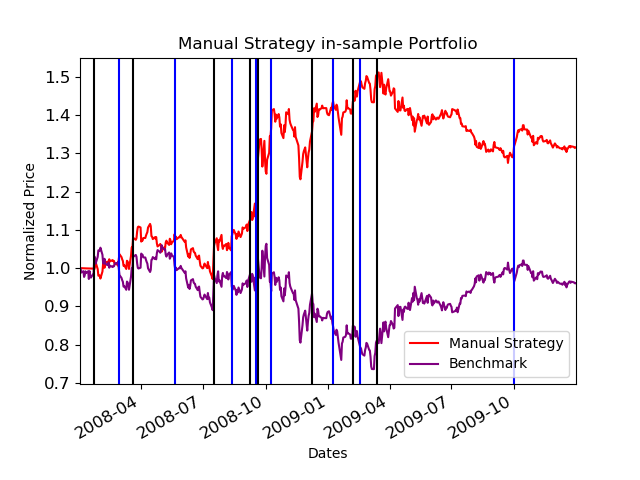
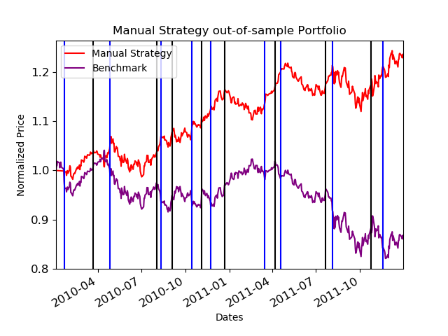
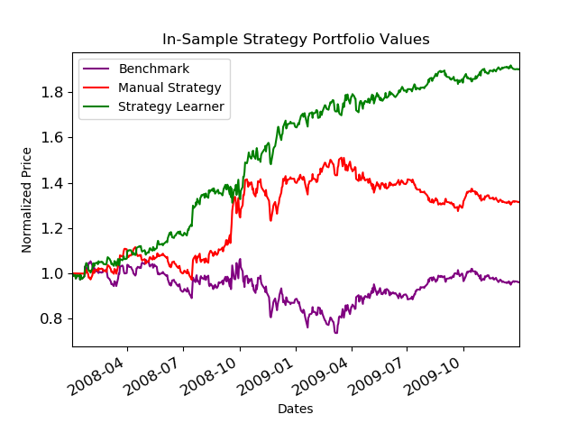
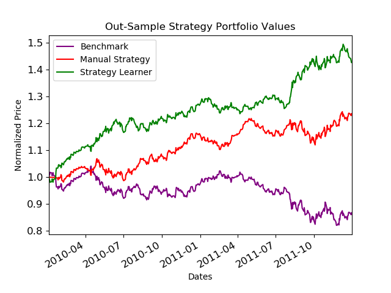
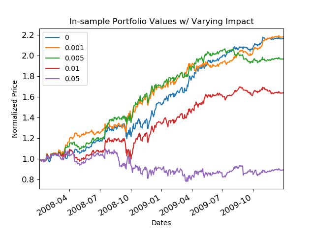

# Active Stock Portfolio Manager
This active portfolio manager learns its trading strategy through a manually implemented random forest model, denoted as the Strategy Learner, which predicts the optimal holding postition to take each day in the market simulator. Using historic technical indicators SMA/p, Bollinger Bands as inputs, I compare the performance of my active random forest trader to a simple heuristic model, denoted as Manual Strategy, and a Benchmark long position.
  
Running testlearner.py will output the png and txt files within the 'images' folder.  
  
StockPortfolioManager_Report.pdf contains deeper explanation and analysis.  

  
The x training data comes from the pSMa, pBB, and Momentum of the normalized JP Morgan stock data from 2008-1-1 to 2009-12-31, while y training data is
generated by looking at normalized price data 14 days ahead and recording the optimal holding position. Normalizing the price data makes for easier
interpretation later on.

A limitation for these experiemnts is that each portfolio starts at $100,000 (sv) and holdings are limited to 1000, -1000 (short position), or 0 shares at any one time. A flag is used to reflect our current holdings and determine what trades are valid. A flag equal to 0, means we can buy or sell 1000 shares, while a flag of -1 or 1 allows us to buy or sell 2000 shares. After the flag is identified, we test the y value for being greater than or less than 0 and trade accordingly. These trades are applied to the price data through the market simulator.  
  
  
- The Benchmark position simply buys 1000 sharers on day 1 of the market sim and holds that position until the last day.

- The Manual Strategy checks the values of the predictor indicators to be within a stable range, 
0.8 < pSMA < 1.2, 0.0 < pBollingBands < 1.0, -0.2 < Momentum < 0.2

- The StrategyLearner is a manually implemented random forest model that uses the indicator values which use a lookback of 14 days to predict the optimal holding position, derived from the normalized price data.  

Manual_In_Sample.png & Maunal_Out_Sample.png graphs compares training and testing performances of the manual heuerstic strategy, which checks the values of the predictor indicators to be within a stable range, to the benchmark position. The vertical blue lines represent times when the Manual Strategy chose a long position, while the black lines represent short positions. Manual_Stats.txt contains summary performance statistics.

#### Manual_In_sample vs. Benchmark - Normalized Value

  
#### Manual_Out_sample vs. Benchmark - Normalized Value  
  

Experiment 1 introduces the Random Forest "Staregy Learner" to the training and testing comparisons. Exp1.txt contains summary performance statistics. 
  
#### Strategy Learner Comparisons - Normalized Values  
  

#### Strategy Learner Comparisons - Normalized Values  
 
  
    
    
Experiment 2 obersves the effects of the "market impact" parameter on the training performance of the Strategy Learner, which is a measure of how much our trades affect the market value of the stock. Exp2.txt contains summary perforamnce staistics.

#### Variable Impact - Strategy Learner Comparisons - Normalized Values  
 
